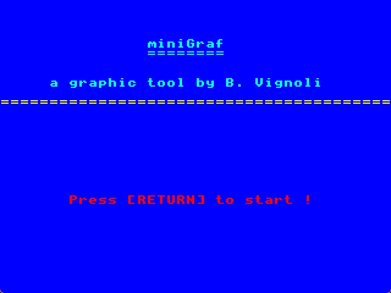

# miniGraf
 
miniGraf is a simple vectorial graphic tool for Agon series.
it is usefull to create retro images for your adventure text games.
You can even export a BASIC source code file with your graphics inside.
Push 'h' key for Help.

miniGraf is written in BBC BASIC and is under MIT licence.

Keys list:
----------

m			move cursor at position
p			plot at cursor position
l			draw a line
t 			draw a filled triangle
r			draw a filled rectangle
d			draw a filled disc
f			fill (todo!!!)

arrow Keys		move the cursor
del				new scene
h				help
+-				change pen color
Alt+-			change paper color
Ctrl+-			change cursor speed
u				undo
f12				quit

L				load
S				save
E				export BASIC
