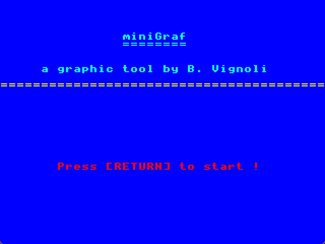
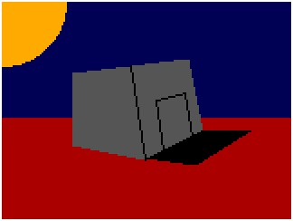

# miniGraf
 
miniGraf is a simple vectorial graphic tool for Agon series.
it is usefull to create retro images for your adventure text games.
You can even export a BASIC source code file with your graphics inside.
Push 'h' key for Help.

miniGraf is written in BBC BASIC and is under MIT licence.

While in miniGraf, type h to view help.
("Fill" function will be implemented in the futur, if possible)

*) When you export a picture you've done, don't forget to add this line of code before : "MODE 8:VDU 26:COLOUR 128:CLS:VDU 23,1,0:VDU 23,0,&C0,0"

*) Don't forget the image you save can be in the app folder or in the root folder, depending on what commands you use to run miniGraf.
   If you use *CD miniGraf and RUN"miniGraf", the images will be saved in miniGraf folder.
